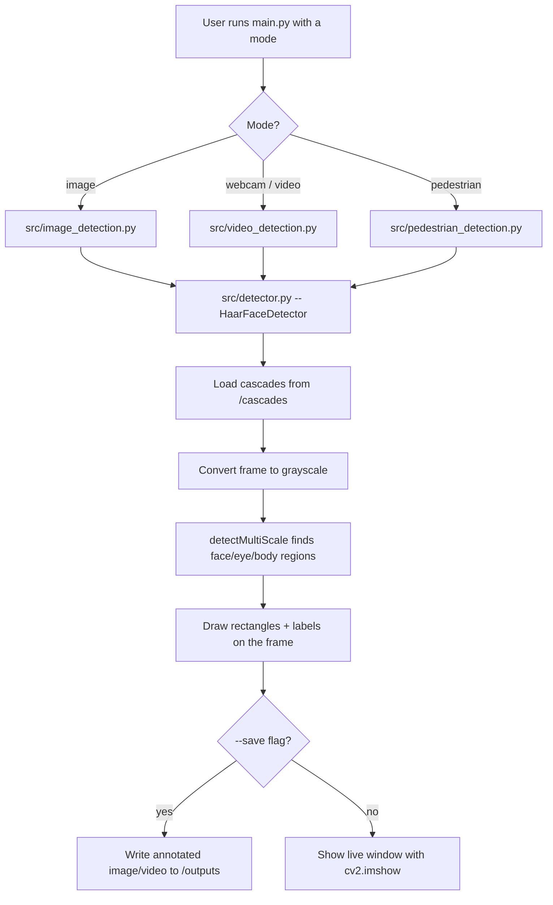

# Real-Time Face, Eye & Pedestrian Detection using Haar Cascades (OpenCV)

A computer-vision project that detects **faces, eyes, smiles, and pedestrians**
in images, video files, and a live webcam feed using OpenCV's Haar Cascade
classifiers — wrapped in a clean, configurable, single-entry-point CLI
instead of scattered standalone scripts.

> **Suggested GitHub repository name:** `haar-cascade-face-detection`
> **Suggested one-line repo description (for the GitHub "About" box):**
> "Real-time face, eye, smile & pedestrian detection using OpenCV Haar Cascades — image, video, and webcam support via a single CLI."
> **Suggested topics/tags:** `opencv` `python` `computer-vision` `face-detection` `haar-cascade` `object-detection` `image-processing`

---

## ✨ Features

- **Single unified CLI** (`main.py`) — one command, four modes: `image`, `webcam`, `video`, `pedestrian`
- **Multi-face detection** — works on a single portrait or a crowd photo
- **Eye and smile detection nested inside each detected face**
- **Live webcam mode** with a real-time FPS counter overlay
- **Video file mode** with optional annotated-output recording (`--save`)
- **Pedestrian / full-body detection** on video, as a second Haar cascade use case
- **Configurable detection sensitivity** (`--scale-factor`, `--min-neighbors`) instead of hard-coded magic numbers
- **Auto-downloader** for the official OpenCV cascade files, so the repo stays light
- Clean separation of concerns: `src/detector.py` is the reusable engine every script imports

## 🗂 Project Structure

```
haar-cascade-face-detection/
├── main.py                     # Single entry point — dispatches to the right mode
├── requirements.txt
├── LICENSE
├── README.md
├── cascades/                   # Haar cascade XML files (auto-downloadable)
│   ├── haarcascade_frontalface_default.xml
│   ├── haarcascade_eye.xml
│   ├── haarcascade_smile.xml
│   └── haarcascade_fullbody.xml
├── src/
│   ├── detector.py             # Core HaarFaceDetector class (loads cascades, annotates frames)
│   ├── download_cascades.py    # Fetches cascade files from OpenCV's official GitHub repo
│   ├── image_detection.py      # CLI: detect faces/eyes/smiles in a still image
│   ├── video_detection.py      # CLI: detect faces/eyes/smiles in webcam or video, live FPS
│   └── pedestrian_detection.py # CLI: detect pedestrians (full body) in a video
├── sample_media/
│   ├── images/                 # Drop your own test images here (see its README.md)
│   └── videos/
│       └── street_pedestrians_demo.avi   # ready-to-run sample video (OpenCV BSD sample)
└── outputs/                    # Annotated results get saved here when you pass --save
```

## 🔀 Workflow — which file runs, and in what order



In plain terms:
1. **`main.py`** is the only file a user needs to run — it reads the mode (`image`/`webcam`/`video`/`pedestrian`) and forwards the remaining arguments.
2. That mode's script (`image_detection.py`, `video_detection.py`, or `pedestrian_detection.py`) parses CLI flags like `--input`, `--eyes`, `--save`.
3. All three scripts share the same engine: **`src/detector.py`**, which loads the XML cascades once, converts frames to grayscale, and runs `detectMultiScale`.
4. Detected regions are drawn back onto the original color frame and either displayed live or saved to `/outputs`.
5. If a cascade file is ever missing, **`src/download_cascades.py`** re-fetches it from OpenCV's official repository.

## 🚀 Getting Started

```bash
# 1. Clone and enter the repo
git clone https://github.com/<your-username>/haar-cascade-face-detection.git
cd haar-cascade-face-detection

# 2. Install dependencies
pip install -r requirements.txt

# 3. (Cascades already included, but if you ever need to refresh them)
python src/download_cascades.py

# 4. Run it
python main.py image -i sample_media/images/your_photo.jpg --eyes
python main.py webcam
python main.py video --source sample_media/videos/street_pedestrians_demo.avi
python main.py pedestrian --source sample_media/videos/street_pedestrians_demo.avi
```

## 🧠 How Haar Cascade detection works (short version)

A Haar cascade is a machine-learning object detector trained on thousands of
positive (face) and negative (non-face) images. It scans an image at multiple
scales using simple rectangular features (edges, lines) and a cascade of
increasingly strict classifiers, quickly discarding regions that are clearly
not a face so it can run in real time on a CPU. That speed/accuracy trade-off
is exactly why it's still a great choice for lightweight, real-time detection
compared to heavier deep-learning detectors.

## 🛣 Possible next steps (ideas for extending this further)

- Swap Haar cascades for a DNN face detector (OpenCV's `res10_300x300_ssd`) for higher accuracy on angled/occluded faces
- Add face recognition (not just detection) with `face_recognition` or `dlib`
- Wrap `main.py` in a Streamlit app for a shareable browser demo
- Add unit tests with `pytest` for `detector.py`
- Containerize with Docker for one-command reproducibility

---

## 📄 For your Resume

> Built a real-time face, eye, and pedestrian detection system in Python using
> OpenCV Haar Cascade classifiers, supporting image, video, and live webcam
> input through a unified CLI; designed a modular, reusable detection engine
> and configurable sensitivity parameters, and published it as an open-source
> project on GitHub.

Shorter bullet version:
> **Face & Pedestrian Detection System (OpenCV, Python)** — Real-time multi-face/eye/pedestrian detection via Haar Cascades with a unified CLI supporting image, video, and webcam input. [GitHub link]

## 💼 For LinkedIn

> 🚀 Excited to share my latest project: **Real-Time Face, Eye & Pedestrian Detection using OpenCV Haar Cascades!**
>
> I took a classic computer vision technique and rebuilt it as a proper,
> production-style mini application:
> ✅ Detects single or multiple faces in images
> ✅ Nested eye & smile detection inside each face
> ✅ Real-time webcam detection with a live FPS counter
> ✅ Pedestrian/full-body detection on video
> ✅ One unified CLI instead of scattered scripts, with configurable detection sensitivity
>
> It's a great reminder that you don't always need a heavy deep learning
> model to get real-time results — Haar cascades are fast, lightweight, and
> still genuinely useful.
>
> Code (MIT licensed): github.com/\<your-username>/haar-cascade-face-detection
>
> #OpenCV #Python #ComputerVision #MachineLearning #ArtificialIntelligence #Projects

---

## 📜 License

MIT — see [LICENSE](LICENSE). Haar cascade XML files are redistributed from
the official [OpenCV repository](https://github.com/opencv/opencv) under its
BSD license. `street_pedestrians_demo.avi` is OpenCV's own public sample data.
